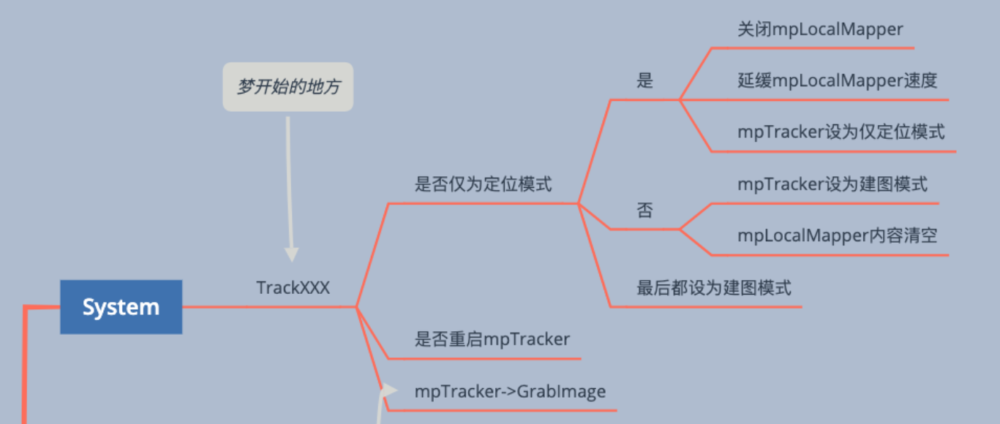
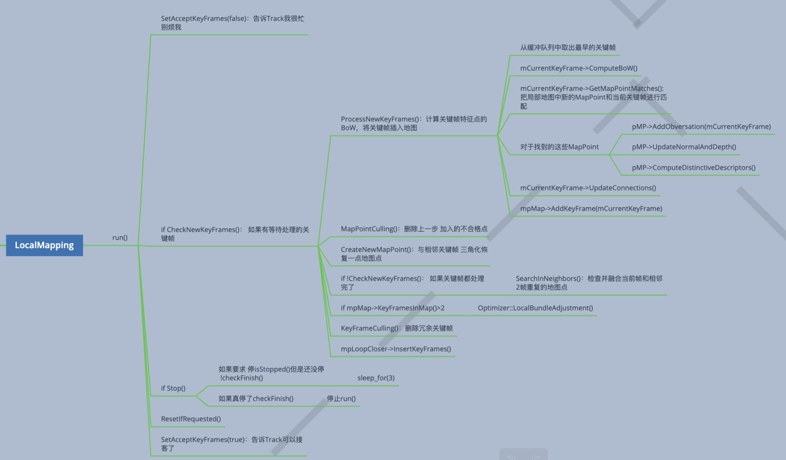

# 定位以及建立语义地图

## ORB-SLAM3

RGB-D 加 IMU 组成的紧耦合 VIO 系统：

VIO（Visual-Inertial Odometry）即视觉惯性里程计，有时也叫视觉惯性系统（VINS，Visual-Inertial System），是融合相机和IMU数据实现SLAM的算法，根据融合框架的区别又分为紧耦合和松耦合，松耦合中视觉运动估计和惯导运动估计系统是两个独立的模块，将每个模块的输出结果进行融合，而紧耦合则是使用两个传感器的原始数据共同估计一组变量，传感器噪声也是相互影响的，紧耦合算法上比较复杂，但充分利用了传感器数据，可以实现更好的效果，是目前研究的重点。

视觉和IMU各自独立算出位姿，我们对两个位姿进行融合，这种方式叫松耦合。在这种方式中，视觉和 IMU 各算各的，彼此不会有干扰。而紧耦合则是相反。在计算位姿的时候我们就会同时利用视觉和IMU的信息，最后只输出一个由视觉和IMU共同计算得到的位姿。明确了紧耦合、松耦合的定义以后，再来看本段开头的问题就很容易了——ORB-SLAM3 采用的是紧耦合的策略。

### System

### Tracking

#### Frame

### Local Mapping

## 卡尔曼滤波与惯性测量单元

使用惯性测量单元（Inertial Measurement Unit，简称IMU）时，由于其测量误差很大，得到的数据需要进行处理后才能使用。

# 机器人在野外环境的自主导航

Autonomous Exploration自主探索

移动机器人**自主探索**最主要的任务是确定机器人下一步的期望运动位置，最终实现全局范围内以最短无碰撞路径获取最多未知正确环境信息。

Autonomous Navigation 自主导航

自主导航和自主探索都涉及两个问题：一个是自身定位和环境地图构建（SLAM），一个是路径规划（Path Planing）。后者包括全局路径规划和局部避障（Obstacle Avoidance）。区别于自主导航，自主探索不包含明确的目标点（Goals），根据已知区域探索未知区域，需要找到边界条件，优化机器人的行走路径，以最小的代价完成未知环境的探索。

The autonamous navigation is based on PUTN.

PUTN consists of three parts :

- Global Planning Module (Implemented by **PF-RRT***) ;
- GPR Module (Gaussian Process Regression) ;
- Local Planning Module (Implemented by **NMPC**, Nonlinear Model Predictive Control) .

## Global Planning

The global planning is based on :

- **Plane Fitting RRT*** (PF-RRT*) algorithm.
- Terrain Assessment.

## Gaussian Process Regression Prediction

## Local Planning

###  Nonlinear Model Predictive Control

确定状态变量、控制变量：
$$
\boldsymbol{x}
=
\begin{bmatrix}
p_x \\ p_y \\ \theta
\end{bmatrix}, \

\boldsymbol{u}
=
\begin{bmatrix}
v \\ \omega
\end{bmatrix}
$$

$$
\dot{\boldsymbol{x}}
=
\begin{bmatrix}
\dfrac{dp_x}{dt} \\
\dfrac{dp_y}{dt} \\
\dfrac{d\theta}{dt}
\end{bmatrix}
=
\begin{bmatrix}
v\cos{\theta} \\
v\sin{\theta} \\
\omega
\end{bmatrix}
$$

Weighting Matrix
$$
\boldsymbol{S} = \boldsymbol{Q} =
\begin{bmatrix}
1.2 & 0 & 0 \\
0 & 1.2 & 0 \\
0 & 0 & 0
\end{bmatrix}, \

\boldsymbol{R} =
\begin{bmatrix}
0.2 & 0 \\
0 & 0.15
\end{bmatrix}
$$
Cost function:
$$
J = (\boldsymbol{x}_n - \boldsymbol{x}_d)^T\boldsymbol{S}(\boldsymbol{x}_n - \boldsymbol{x}_d)
+ \sum_{k=0}^{n-1}
\Big((\boldsymbol{x}_k - \boldsymbol{x}_d)^T\boldsymbol{Q}(\boldsymbol{x}_k - \boldsymbol{x}_d)
+ \boldsymbol{u}_k^T\boldsymbol{R}\boldsymbol{u}_k \Big)
$$

- $\boldsymbol{x}_n$：表示末端状态，也就是某个控制过程中的最终状态；
- $\boldsymbol{x}_k$：表示过程状态，也就是某个控制过程中间的状态；
- $n$：$n\cdot T_s$ 即采样时间乘以 $n$ 等于模型预测控制中的**预测区间**（Prediction Horizon）。

# 实验与验证Simulation

## Webots

### Webots 相机内参计算

成像宽度为 $W$，高度为 $H$，视场角 $FOV$ 为 $\theta$，则
$$
\begin{align}
f_x &= \frac{W}{2\tan(\theta/2)} \\
f_y &= \frac{H}{2\tan(\theta/2)} \\
c_x &= \frac{W}{2} \\
c_y &= \frac{H}{2}
\end{align}
$$

# 总结与展望

