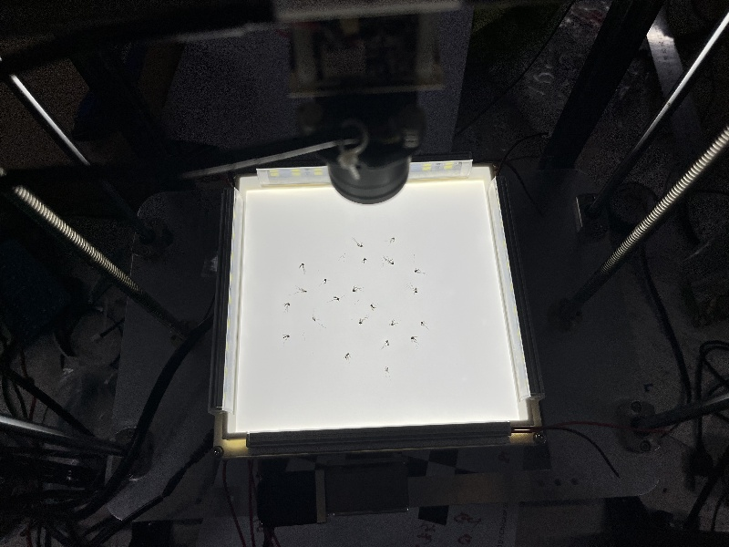

# 绪论


# 昆虫信息采集平台

该昆虫信息采集系统主要负责诱捕昆虫，并自动进行拍照，采集图像信息。需要注意的是，它在一次工作中只能指定一种目标昆虫，在下文中将会把“目标昆虫”简称为”靶虫“。具体采取何种措施可以使设备只引诱特定的靶虫涉及到引诱源、捕捉口的大小等因素，因为其不是该研究的重点，故本文不作讨论。研究中主要以蚊子作为实验研究对象。

## 算法流程图


TODO……


## 确定判定靶虫的阈值

### 图像与预理

由于使用经典视觉算法，通过计算二值化图像中白色像素的面积（单位：像素的个数）来判定黑色像素是否是靶虫，以及靶虫是否产生了堆积。这里就涉及到选取合适的阈值（Threashhold）的问题。通过选取阈值：即单个靶虫的面积的最小值和最大值、多个靶虫堆积后的面积最小值和最大值，来使视觉识别的准确率达到较高的水平。

由于不管是相机传感器自身的误差还是靶虫的大小尺寸都是服从于正态分布（Normal Distribution）的，那么问题就有了着手点。

通过 OpenCV 开源视觉算法库对图像进行预处理，即图像滤波（Filter）和二值化（Binary）处理。

通过可变焦距摄像头获得的原始图像如下：


经过图像滤波以及二值化处理后，得到的图像如下：


需要注意的是，用于在该视觉识别过程中提供的背光是不存在边缘或者四个角的弱化现象的，具体如下图所示，通过摄像头得到的原始图像的四个角的黑色以及其产生的畸变均为镜头或者传感器产生的误差，当然，这些都能通过后期算法和程序进行弥补，重要的是我们发现了这些误差的存在。




### 深度优先搜索确定连通区域

TODO…


### 对靶虫的面积进行数据分析

对图像中的白色连通区域进行定位，并计算白色像素的面积，最后计算结果如下：


得到单个靶虫的像素面积数据如下：

|   靶虫序号   |  1   |  2   |  3   |  4   |  5   |  6   |  7   |  8   |  …   |
| :----------: | :--: | :--: | :--: | :--: | :--: | :--: | :--: | :--: | :--: |
| **像素面积** | 552  | 503  | 497  | 338  | 606  | 210  | 285  | 491  |  …   |

如上文所说，不管是相机传感器自身的误差还是靶虫的大小尺寸都是服从于正态分布（Normal Distribution）的，那么根据实验得到的数据进行计算，可以得到相应的均值（Mean）和标准差（Standard Deviation）。
$$
Formula ...\\
\mu=...\\
\sigma=...
$$
然后根据计算得到的数据的均值和标准差，画出单个靶虫像素面积的正态分布概率密度曲线。


对两两堆积的靶虫进行测试，得到计算结果：


得到两个靶虫堆积后的像素面积数据如下：

|   靶虫序号   |  1   |  2   |  3   |  4   |  5   |  6   |  7   |  8   |  …   |
| :----------: | :--: | :--: | :--: | :--: | :--: | :--: | :--: | :--: | :--: |
| **像素面积** | 1106 | 736  | 901  | 1125 | 802  | 1018 | 588  | 624  |  …   |

根据实验得到的数据进行计算，可以得到相应的均值（Mean）和标准差（Standard Deviation）。
$$
Formula ...\\
\mu_{heap}=...\\
\sigma_{heap}=...
$$
然后根据计算得到的数据的均值和标准差，画出两个靶虫堆积像素面积的正态分布概率密度曲线。


通过20次重复实验，实验内容为诱捕靶虫，时间持续一个小时，得到最大的堆积面积，实验数据如下：

靶虫最大的堆积像素面积数据如下：

|   实验序号   |   1   |   2   |  3   |   4   |   5   |  6   |   7   |  8   |  …   |
| :----------: | :---: | :---: | :--: | :---: | :---: | :--: | :---: | :--: | :--: |
| **像素面积** | 12745 | 12789 | 7946 | 12824 | 12743 | 9912 | 11802 | 7851 |  …   |

根据实验得到的数据进行计算，可以得到相应的均值（Mean）和标准差（Standard Deviation）。
$$
Formula ...
$$
然后根据计算得到的数据的均值和标准差，画出靶虫最大的堆积面积的正态分布概率密度曲线。


balabala…


balabala…

### 确定阈值

根据目的，或者说工作需求来制定策略，由于我们在采集靶虫信息过程中希望尽量不要采集到无效的的数据，而不是尽量采集到更多的信息，所以很自然的，制定如下策略：“宁冤毋纵”，即

- 宁愿以为像素面积较小的的单个靶虫不是目标单个靶虫，也不愿将像素面积较大的阴影或者其他造成误差的因素误认为是单个靶虫；
- 宁愿以为像素面积较大的的单个靶虫是多个靶虫堆积，也不愿将像素面积较小的多个靶虫堆积误认为是单个靶虫。

$$
\mu+3\sigma=704.34\\
\mu_{heap}-3\sigma_{heap}=297.55
$$

确定三个阈值（Threashold）：$thr_1$，$thr_2$，$thr_3$。

- 像素面积小于 $thr_1$ 的的连通区域将被当作噪声；
- 像素面积位于 $thr_1$ 到 $thr_2$ 之间的连通区域将被当作单个靶虫，也就是我们需要进行图像采集的区域；
- 像素面积位于 $thr_2$ 到 $thr_3$ 之间的连通区域将被当作多个靶虫的堆积区域，也就是我们需要进行图像采集的区域；
- 像素面积大于 $thr_3$ 的的连通区域将被当作噪声。

$$
thr_1=122.4\\
thr_2=588.77\\
thr_3=13052
$$


## 摄像头真实坐标获取及计算

### 相机标定

打印一张标定板（黑白棋盘格），确定格子的边长（单位：毫米）以及标定板角点的长宽（以角点的列数和行数表示）。

标定板如图：


标定板的角点如图：


该标定板的黑白棋盘格的长为 9 格，宽为 6 格；但是==角点长为 8 个，宽为 5 个==。

Use a ROS2 package “camera_calibration” to calibrate the camera, like this:

```bash
ros2 run camera_calibration cameracalibrator --size 8x5 --square 0.019 image:=/image_raw camera:=/my_camera
```

> - `--size` : Represent the width and height of the corner points.
> - `--square` : Represent the size of black checkerboard square, (unit: m).
> - `image` : Represent the topic that publishes the image data from the camera.

相机内参矩阵（Camera Intrinsics Matrix）为
$$
K=
\begin{bmatrix}
f_x&0&c_x\\
0&f_y&c_y\\
0&0&1
\end{bmatrix}
$$

### 坐标计算

要通过相机图像像素坐标得到真实世界的物体坐标，需要进行相机标定。相机标定可以得到相机的内参和外参，内参包括相机的焦距、光心等参数，外参包括相机的旋转和平移矩阵。

在进行相机标定后，可以使用以下步骤来将相机图像像素坐标转换为真实世界的物体坐标：

1. 对于给定的像素坐标 $(u,v)$，计算出其对应的归一化坐标 $(x,y)$。归一化坐标是将像素坐标转换为相机坐标系下的坐标，通常使用以下公式进行计算：
   $$
   x = \frac{u - c_x}{f_x}\\
   y = \frac{v - c_y}{f_y}
   $$
   其中，$f_x$ 和 $f_y$ 是相机的焦距，$c_x$ 和 $c_y$ 是相机的光心坐标。	

2. 根据深度值 $d$，计算出对应的点的三维坐标 $(X,Y,Z)$。可以使用以下公式进行计算：
   $$
   X = x \times d\\
   Y = y \times d\\
   Z = d
   $$
   其中，$Z$ 就是深度值，$X$ 和 $Y$ 的计算使用归一化坐标和深度值相乘即可。	

3. 使用相机的外参将相机坐标系下的坐标转换为真实世界坐标系下的坐标。外参包括相机的旋转矩阵和平移向量，可以使用以下公式将相机坐标系下的坐标 $(X_c,Y_c,Z_c)$ 转换为真实世界坐标系下的坐标 $(X_w,Y_w,Z_w)$：
   $$
   \begin{bmatrix}X_wY_wZ_w\end{bmatrix} = R\begin{bmatrix}X_cY_cZ_c\end{bmatrix} + T
   $$
   其中，$R$ 是相机的旋转矩阵，$T$ 是相机的平移向量。

通过以上步骤，可以将相机图像像素坐标转换为真实世界的物体坐标。需要注意的是，在计算真实世界坐标时，深度值$d$应该与归一化坐标$(x,y)$对应的点的深度值相同。否则，计算出的坐标将不准确。


### 减小误差

由于


#### 相对位置法

提取


#### 误差补偿

引入误差补偿

如何评价误差补偿？通过建立误差补偿和绝对深度误差的曲线来评价。

“计算时间“ 与误差之间的平衡。


## 振动盘振动策略


## 景深融合


# 定位以及建立语义地图

## ORB-SLAM3

### System


### Tracking

#### Frame


### Local Mapping


## 卡尔曼滤波与惯性测量单元

使用惯性测量单元（Inertial Measurement Unit，简称IMU）时，由于其测量误差很大，得到的数据需要进行处理后才能使用。


# 机器人在野外环境的自主导航

Autonomous Exploration自主探索

移动机器人**自主探索**最主要的任务是确定机器人下一步的期望运动位置，最终实现全局范围内以最短无碰撞路径获取最多未知正确环境信息。

Autonomous Navigation自主导航

自主导航和自主探索都涉及两个问题：一个是自身定位和环境地图构建（SLAM），一个是路径规划（Path Planing）。后者包括全局路径规划和局部避障（Obstacle Avoidance）。区别于自主导航，自主探索不包含明确的目标点（Goals），根据已知区域探索未知区域，需要找到边界条件，优化机器人的行走路径，以最小的代价完成未知环境的探索。


## PUTN

PUTN consists of three parts:

- Global Planning Module (Implemented by **PF-RRT***)
- GPR Module (Gaussian Process Regression)
- Local Planning Module (Implemented by **NMPC**, Nonlinear Model Predictive Control)


## Global Planning: PF-RRT*


## Gaussian Process Regression


## Local Planning

###  Nonlinear Model Predictive Control

确定状态变量、控制变量：
$$
\boldsymbol{x}
=
\begin{bmatrix}
p_x \\ p_y \\ \theta
\end{bmatrix}, \

\boldsymbol{u}
=
\begin{bmatrix}
v \\ \omega
\end{bmatrix}
$$

$$
\dot{\boldsymbol{x}}
=
\begin{bmatrix}
\dfrac{dp_x}{dt} \\
\dfrac{dp_y}{dt} \\
\dfrac{d\theta}{dt}
\end{bmatrix}
=
\begin{bmatrix}
v\cos{\theta} \\
v\sin{\theta} \\
\omega
\end{bmatrix}
$$


Weighting Matrix
$$
\boldsymbol{S} = \boldsymbol{Q} =
\begin{bmatrix}
1.2 & 0 & 0 \\
0 & 1.2 & 0 \\
0 & 0 & 0
\end{bmatrix}, \

\boldsymbol{R} =
\begin{bmatrix}
0.2 & 0 \\
0 & 0.15
\end{bmatrix}
$$
Cost function:
$$
J = (\boldsymbol{x}_n - \boldsymbol{x}_d)^T\boldsymbol{S}(\boldsymbol{x}_n - \boldsymbol{x}_d)
+ \sum_{k=0}^{n-1}
\Big((\boldsymbol{x}_k - \boldsymbol{x}_d)^T\boldsymbol{Q}(\boldsymbol{x}_k - \boldsymbol{x}_d)
+ \boldsymbol{u}_k^T\boldsymbol{R}\boldsymbol{u}_k \Big)
$$

- $\boldsymbol{x}_n$：表示末端状态，也就是某个控制过程中的最终状态；
- $\boldsymbol{x}_k$：表示过程状态，也就是某个控制过程中间的状态；
- $n$：$n\cdot T_s$ 即采样时间乘以 $n$ 等于模型预测控制中的**预测区间**（Prediction Horizon）。


# 实验与验证Simulation

## Webots

### Webots 相机内参计算

成像宽度为 $W$，高度为 $H$，视场角 $FOV$ 为 $\theta$，则
$$
f_x=\frac{W}{2\tan(\theta/2)}\\
f_y=\frac{H}{2\tan(\theta/2)}\\
c_x=\frac{W}{2}\\
c_y=\frac{H}{2}
$$


# 总结与展望


